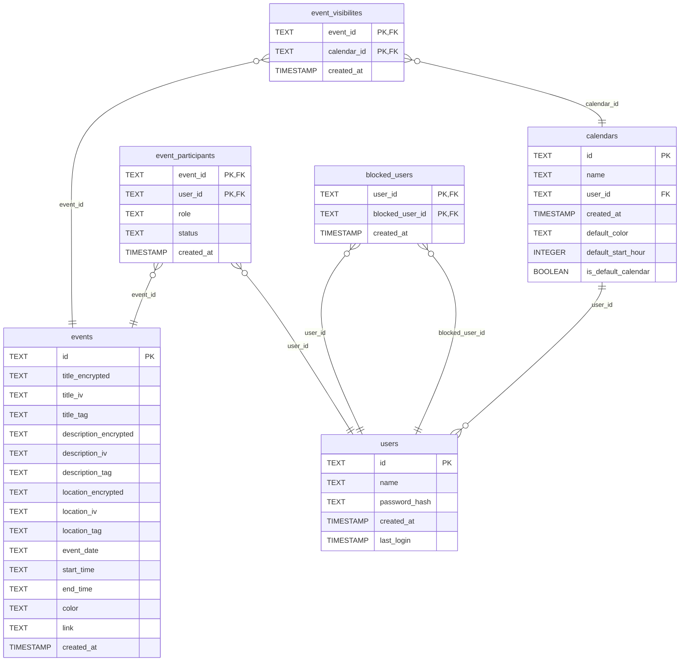

```mermaid
erDiagram
  users {
    TEXT id PK
    TEXT name
    TEXT password_hash
    TIMESTAMP created_at
    TIMESTAMP last_login
  }
  calendars {
    TEXT id PK
    TEXT name
    TEXT user_id FK
    TIMESTAMP created_at
    TEXT default_color
    INTEGER default_start_hour
    BOOLEAN is_default_calendar
  }
  calendars ||--o{ users : "user_id"
  events {
    TEXT id PK
    TEXT title_encrypted
    TEXT title_iv
    TEXT title_tag
    TEXT description_encrypted
    TEXT description_iv
    TEXT description_tag
    TEXT location_encrypted
    TEXT location_iv
    TEXT location_tag
    TEXT event_date
    TEXT start_time
    TEXT end_time
    TEXT color
    TEXT link
    TIMESTAMP created_at
  }
  event_visibilites {
    TEXT event_id PK, FK
    TEXT calendar_id PK, FK
    TIMESTAMP created_at
  }
  event_visibilites }o--|| events : "event_id"
  event_visibilites }o--|| calendars : "calendar_id"
  event_participants {
    TEXT event_id PK, FK
    TEXT user_id PK, FK
    TEXT role
    TEXT status
    TIMESTAMP created_at
  }
  event_participants }o--|| events : "event_id"
  event_participants }o--|| users : "user_id"
  blocked_users {
    TEXT user_id PK, FK
    TEXT blocked_user_id PK, FK
    TIMESTAMP created_at
  }
  blocked_users }o--|| users : "user_id"
  blocked_users }o--|| users : "blocked_user_id"
```
