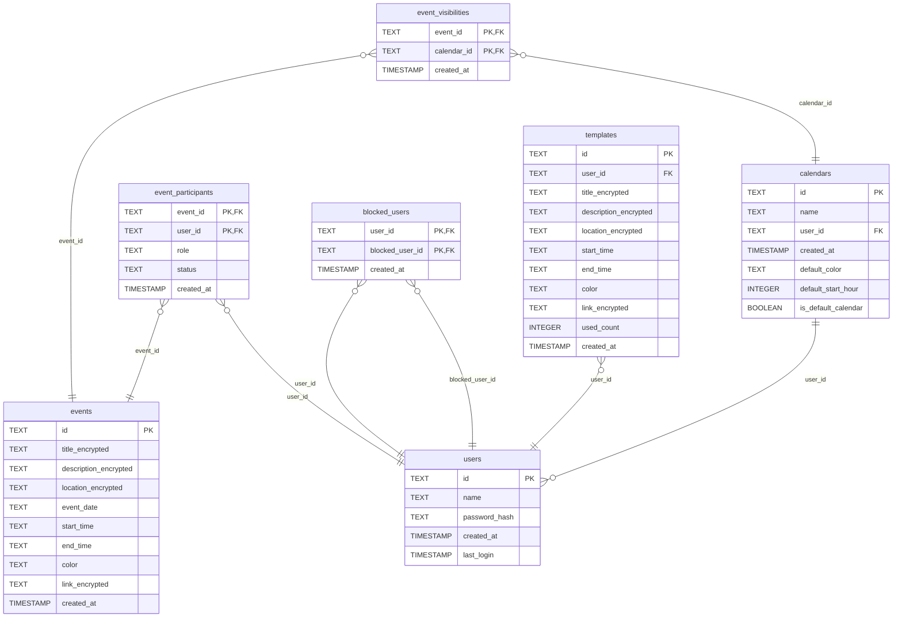

# Svalendar

Svalendar is a calendar application for managing events and schedules.

<https://svalendar.netlify.app>

  

## Features

- **Mobile-Friendly**: Responsive design for mobile, tablet, and desktop devices.
- **Event Sharing**: Share events with other users who can accept or decline invitations.
- **Multiple Calendars**: Supports creating and managing separate calendars.
- **Event Templates**: Create reusable templates to quickly set up new events.
- **No Vendor Lock-In**: Does not rely on third-party services like Google or Microsoft.
- **Backup to JSON**: Allows exporting calendars to a JSON file.
- **Block Users**: Block specific users to prevent receiving event invites from them.
- **Encrypted Events**: All events are stored encrypted in the database for security.

## Tech Stack

- **Framework**: Built with [SvelteKit](https://kit.svelte.dev). Hence, the name _Svalendar_.
- **Database**: Uses SQLite for data storage.
- **Authentication**: Self-made authentication system for user management.

## Credits

- **Favicon Source**: <https://loading.io/icon/cgof25>

## Database Structure

